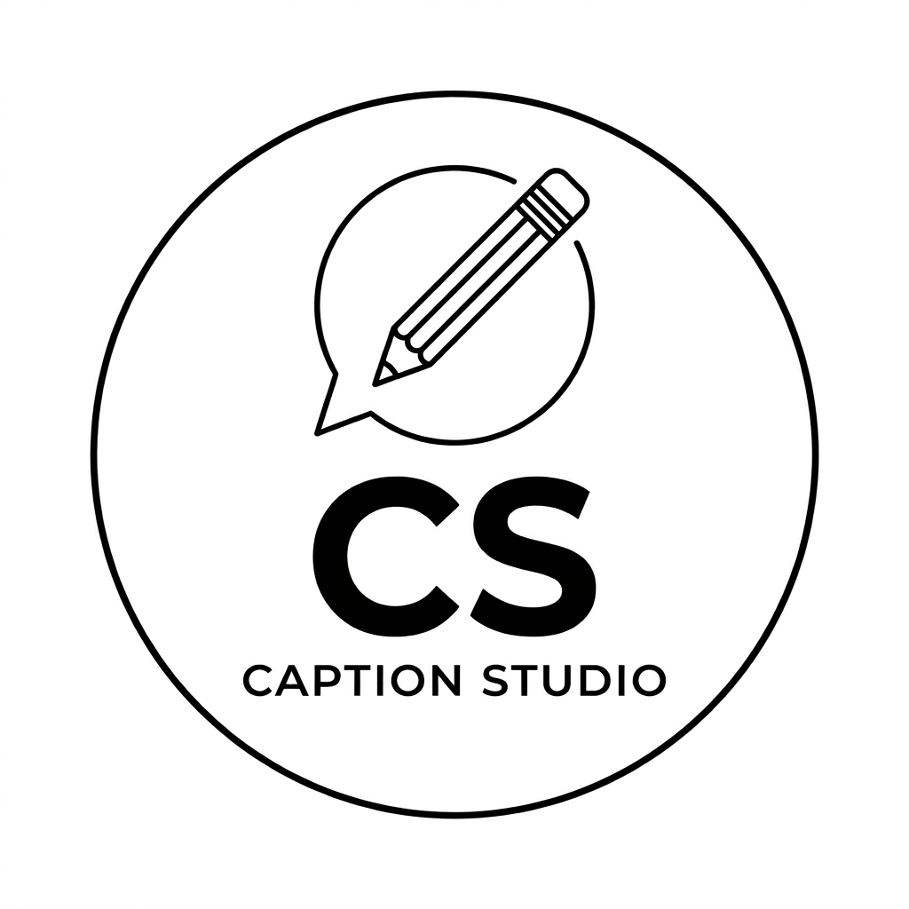

<div align="center">



# ✨ CaptionStudio

### Free Smart Creator Tools for Captions, Hashtags, Bios & Content Growth

<p>
  A fast, mobile-first creator platform built for Indian and global creators.<br>
  Generate content instantly — no login, no subscription, no unnecessary complexity.
</p>

[](https://captionstudio.in)
[](https://github.com/anshyd1/captionstudio-tools/stargazers)
[](https://github.com/anshyd1/captionstudio-tools/commits/main)
[](https://github.com/anshyd1/captionstudio-tools)

<br>

[**🚀 Open CaptionStudio**](https://captionstudio.in) •
[**🛠️ Explore Tools**](https://captionstudio.in/tools/) •
[**📚 Read Guides**](https://captionstudio.in/blog/) •
[**👨‍💻 Developer**](https://github.com/anshyd1)

</div>

---


---

## 🌟 About CaptionStudio

**CaptionStudio** is a free, mobile-first creator toolkit that helps creators, students and small businesses produce better social-media content.

It combines interactive JavaScript tools, SEO-focused content and a fast static architecture to deliver a simple user experience without requiring login or payment.

The platform is designed especially for:

- 📱 Instagram and short-form content creators
- 🎓 Students building a personal brand
- 🏪 Small businesses and local service providers
- 🎥 Reels and YouTube Shorts creators
- ✍️ Content writers and social-media managers
- 🇮🇳 Hindi, English and Hinglish audiences

> **Built in Gorakhpur, Uttar Pradesh, India — for creators everywhere.**

---

## 📊 Real Search Performance

CaptionStudio has achieved measurable organic growth through technical SEO, content optimization and consistent development.

| Google Search Console Metric | Last 3 Months |
|:---|---:|
| 🔵 Organic Clicks | **13.7K** |
| 🟣 Search Impressions | **387K** |
| 🟢 Average CTR | **3.5%** |
| 🟠 Average Position | **6** |
| 📄 Responsive HTML Pages | **130+** |
| 📝 Content & Blog Pages | **100+** |
| 🛠️ Interactive Creator Tools | **3** |

> Search-performance snapshot recorded in **July 2026** using Google Search Console.

---

## 🛠️ Creator Tools

### ✍️ Caption Generator

Generate ready-to-use captions for different niches, tones and content goals.

- Multiple niches and content categories
- Hinglish and English-friendly output
- Gen-Z, motivational, storytelling, sales and other tones
- Three caption variations per generation
- Hook-strength scoring
- One-click copy functionality
- Fully client-side and instant

➡️ [Try Caption Generator](https://captionstudio.in/tools/caption-generator)

---

### #️⃣ Hashtag Generator

Create focused hashtag sets instead of using random, unrelated hashtags.

- Multiple creator niches
- High-, medium- and low-competition sets
- Topic-based hashtag generation
- One-click copy for individual or complete sets
- Fast browser-based processing
- Mobile-friendly interface

➡️ [Try Hashtag Generator](https://captionstudio.in/tools/hashtag-generator)

---

### 📝 Bio Generator

Generate short, professional and creator-friendly social-media bios.

- Multiple bio styles
- Niche and profile personalization
- Large reusable bio library
- Character-friendly output
- Multiple variations per generation
- One-click clipboard support

➡️ [Try Bio Generator](https://captionstudio.in/tools/bio-generator)

---

## 🚀 Key Features

- ⚡ Fast-loading static architecture
- 📱 Fully responsive and mobile-first design
- 🔐 No login or signup required
- 💸 Free to use
- 🌐 Deployed with Vercel
- 🔍 Technical and on-page SEO implementation
- 🗺️ Multiple XML sitemaps
- 🤖 Structured data using JSON-LD
- 🔗 Canonical URLs and internal linking
- 📋 One-click clipboard functionality
- 📴 Service-worker and PWA support
- 🇮🇳 Hindi, English and Hinglish-friendly content
- 🧠 AI-assisted development workflow
- 🛠️ Regular content, usability and SEO improvements

---

## 🔍 SEO Implementation

CaptionStudio is developed with search visibility and crawlability in mind.

### Technical SEO

- Semantic HTML structure
- Responsive viewport implementation
- Canonical URL management
- `robots.txt` configuration
- Multiple XML sitemaps
- Search-engine-friendly URLs
- Mobile usability optimization
- Broken-link monitoring and fixes
- Redirect and duplicate-page handling
- Image and page-performance optimization

### Structured Data

JSON-LD schema is used where relevant, including:

- `WebSite`
- `Organization`
- `Article`
- `BreadcrumbList`
- `FAQPage`
- Other page-specific structured data

### Content SEO

- Search-intent-focused content
- Optimized page titles and descriptions
- Structured heading hierarchy
- Contextual internal linking
- Content clusters
- Image alt attributes
- Regular content updates
- Google Search Console performance tracking

---

## 💻 Technology Stack

<div align="center">


</div>

### Core Technologies

| Area | Technologies |
|:---|:---|
| Frontend | HTML5, CSS3, Vanilla JavaScript |
| UI | Responsive and mobile-first layouts |
| SEO | Metadata, canonicals, schema, sitemaps, robots.txt |
| Version Control | Git and GitHub |
| Deployment | Vercel and static hosting |
| Monitoring | Google Search Console |
| PWA | Service Worker and browser storage |
| Workflow | AI-assisted planning, debugging and optimization |

---

## 📁 Project Structure

```text
captionstudio-tools/
│
├── .github/
│   └── workflows/             # GitHub deployment workflows
│
├── assets/                    # Shared website assets
├── blog/                      # SEO-focused articles and guides
├── contact/                   # Contact-related resources
├── data/                      # Structured content and tool data
├── img/                       # Images and optimized web assets
│
├── tools/
│   ├── index.html
│   ├── caption-generator.html
│   ├── hashtag-generator.html
│   └── bio-generator.html
│
├── index.html                 # Main homepage
├── about.html
├── contact.html
├── earning.html
├── guide.html
├── privacy.html
├── terms.html
├── support.html
│
├── robots.txt
├── sitemap.xml
├── sitemap-main.xml
├── sitemap-tools.xml
├── sitemap-blogs.xml
├── sitemap-images.xml
│
├── sw.js                      # Service worker
├── vercel.json                # Vercel configuration
└── README.md
```

---

## ⚙️ Run Locally

CaptionStudio is a static project, so no complicated installation or build process is required.

### 1. Clone the repository

```bash
git clone https://github.com/anshyd1/captionstudio-tools.git
```

### 2. Open the project directory

```bash
cd captionstudio-tools
```

### 3. Start a local server

Using Python:

```bash
python -m http.server 8000
```

Or:

```bash
python3 -m http.server 8000
```

### 4. Open in your browser

```text
http://localhost:8000
```

> Running through a local server is recommended for testing service workers, routing and browser features.

---

## 🌐 Deployment

The production website is deployed using **Vercel**.

[](https://vercel.com/new/clone?repository-url=https://github.com/anshyd1/captionstudio-tools)

Deployment configuration is available in:

```text
vercel.json
```

The live production version is available at:

### 🔗 https://captionstudio.in

---

## 🧠 AI-Assisted Development

AI tools are used to support:

- Development planning
- Code debugging
- UI and UX exploration
- Content research
- Metadata optimization
- Structured-data planning
- Code review and refactoring
- Repetitive workflow automation

All final implementation is manually reviewed, tested, edited and deployed.

> AI supports the workflow — final ownership and quality control remain human-driven.

---

## 🗺️ Roadmap

- [x] Responsive website architecture
- [x] Caption Generator
- [x] Hashtag Generator
- [x] Bio Generator
- [x] Technical SEO foundation
- [x] Multi-sitemap setup
- [x] Search Console monitoring
- [x] Service-worker support
- [x] Vercel deployment
- [ ] Improve accessibility across all pages
- [ ] Add more creator tools
- [ ] Improve Core Web Vitals
- [ ] Expand multilingual content
- [ ] Add reusable design components
- [ ] Improve automated testing
- [ ] Build additional creator-growth resources

---

## 🤝 Contributions & Feedback

Ideas, bug reports and suggestions are welcome.

You can:

1. Open an issue
2. Suggest a feature
3. Report a broken link
4. Recommend a UI or SEO improvement
5. Submit a pull request with a clear explanation

Please keep contributions focused, documented and easy to review.

---

## 📄 License & Usage

This repository currently does not include an open-source license.

The source code is publicly viewable, but copying, redistributing or commercially reusing substantial parts of the project requires permission from the owner.

For collaboration or usage enquiries, contact:

📧 **anshy4553@gmail.com**

---

## 👨‍💻 Developer

<div align="center">

### Ansh Yadav

**Frontend & Technical SEO Developer**

Building responsive web tools, creator platforms and search-focused digital products using HTML, CSS, JavaScript, SEO and AI-assisted workflows.

[](https://captionstudio.in)
[](https://github.com/anshyd1)
[](mailto:anshy4553@gmail.com)

📍 Gorakhpur, Uttar Pradesh, India

</div>

---

<div align="center">

### ⭐ If CaptionStudio is useful, consider starring the repository!

[](https://github.com/anshyd1/captionstudio-tools/stargazers)

**Built with ❤️, JavaScript and measurable SEO growth.**

</div>
